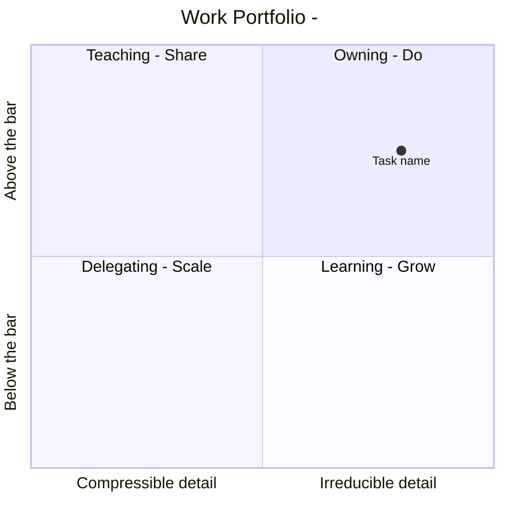

# Determine Work Quadrant

A box is a property of the pair (task, this person, right now) — never of the task alone. The same task is Learning for one person and Teaching for others (mostly a S/W Engineer team), and it moves when either side changes. So placement is only the diagnosis. The move out of the box is the point.

## Axes

| Axis | Question it answers | Low end (0.0) | High end (1.0) |
| --- | --- | --- | --- |
| X — detail demanded | How much of the outcome rides on fine-grained, context-specific judgment that a written brief cannot carry? | A brief plus acceptance criteria is enough for a competent stranger | Correctness depends on tacit history and decisions made on the spot |
| Y — proficiency held | Where does this person stand against the bar this task sets? | Cannot predict the failure modes | Ships it unaided and catches subtle errors in someone else's version |

Both scores need evidence. See [calibration](./references/calibration.md) for the probes, the Dreyfus anchors that fix the numbers, and the delegation levels.

## Boxes

| Box | Position | What it means | Default move | Exit condition |
| --- | --- | --- | --- | --- |
| **Owning** (Do, 담당업무) | high detail, high proficiency | Only you hold the detail, and you clear the bar | Carry it, and start compressing the detail into a brief, a check, or a tool | The brief survives one run by other hands → becomes Teaching |
| **Learning** (Grow, 학습업무) | high detail, low proficiency | The detail is real and you are under the bar | Take it with a named reviewer and a deadline for the first unaided run | One end-to-end delivery unaided → becomes Owning |
| **Teaching** (Share, 교육업무) | low detail, high proficiency | You are past the bar and the detail is already compressible | Hand over the doing, keep the review; teach the rule, not the steps | A learner passes review twice → becomes Delegating |
| **Delegating** (Scale, 위임업무) | low detail, low proficiency | Nothing here needs you | Delegate at an explicit level, with acceptance criteria, and stop reviewing line by line | Someone else owns it outright → it leaves your board |

Movement is a cycle: **Learning → Owning → Teaching → Delegating → capacity for the next Learning bet.** A board where nothing moved this cycle is the finding.

## Procedure

1. **Collect.** Get the tasks and who would carry each one. If the input is one vague task, ask at most four questions: what the finished result looks like, who else could do it, what this person has already shipped in this area, and what breaks if it is done badly.
2. **Score.** Give each task an X and a Y in 0.0–1.0, and write the observation behind each number — a shipped artifact, a review someone passed, a failure that happened. A score with no evidence is a guess; label it as one.
3. **Plot.** Emit the Mermaid chart below.
4. **Read the boxes.** For each task: the box, the move, and the exit condition stated as an observable fact.
5. **Report delegated work.** When an LLM or agent completes a Delegating task, return a compact handoff: the outcome against its acceptance criteria, the delegation level and inputs used, the resulting artifact or evidence, and two to four points that explain the decision, reusable rule, or review boundary. Keep the explanation tied to the task; teach only what helps the user reuse, assess, or extend the result.
6. **Read the shape.** Apply the portfolio table, and say what the distribution reveals about the current level.
7. **Close with two bets and one challenge.** Name exactly one growth bet (the Learning task to force through to Owning) and one release bet (the task to push out of Owning). Then state the one uncomfortable thing the board implies and ask the single question only the user can answer.

## Chart

Mermaid maps `quadrant-1` to top-right and counts counter-clockwise. Keep colons out of point names; the `<label>: [x, y]` form breaks otherwise. Add `radius: 12` to the one or two tasks that carry the most weight so the chart shows stakes, not just position.

## Portfolio shapes

| Shape | What it reveals | Move |
| --- | --- | --- |
| Mostly Owning | Throughput bought with a bus factor of one. Growth turned into volume. | Pick the most repeated Owning task and write its brief this cycle. |
| Mostly Learning | Overextended, with no anchor of demonstrated competence. | Cut to two learning bets; drive one to an unaided delivery. |
| Mostly Teaching | Spending proficiency without renewing it. Credibility is on a timer. | Open one Learning bet in an adjacent domain. |
| Mostly Delegating | Drifting off the craft. Review quality decays before anyone notices. | Reclaim one high-detail task per cycle to stay calibrated. |
| Spread across all four | Sustainable. | Check that the Owning tasks are not the same ones as last cycle. |

Two standing rules: something should always sit in Learning, and no task should stay in Owning unchanged across two cycles.

## Rules

- Report no placement without the evidence that produced it. When the evidence is missing, say the score is unverified and name what would settle it.
- Give every plotted point an exit condition. A box with no way out is a description, not a decision.
- Do not inflate a proficiency score to be kind. An inflated Y sends a Learning task into Owning, and unreviewed work ships.
- Do not deflate one either. A deflated Y keeps someone in supervision past the point where they have earned the handover, which is the more common failure among people who ask this question.
- Low detail plus low proficiency is Delegating, not Learning. Growing on work that teaches nothing is the most expensive mistake this grid catches.
- When motivation is low on a high-detail task, do not call it a growth bet. Route it as Delegating with support, and say why. See the will tiebreaker in [calibration](./references/calibration.md).
- Placing a task for someone else is a leadership act. State the placement to them and let them contest it; a box assigned in private is a judgment, not a plan.
