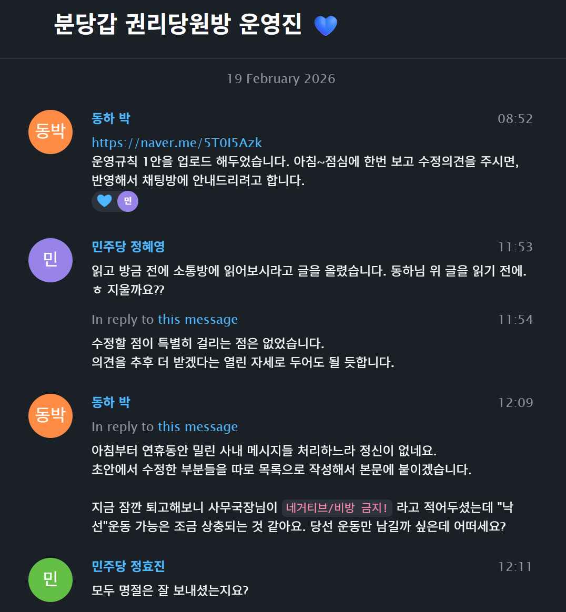
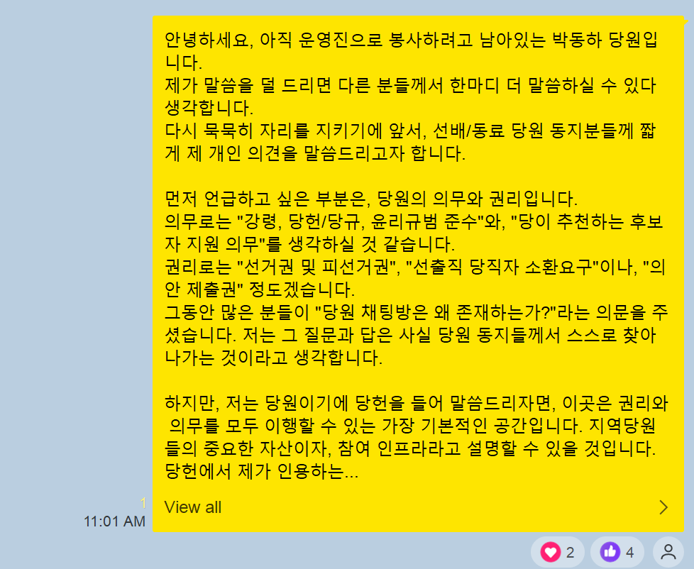
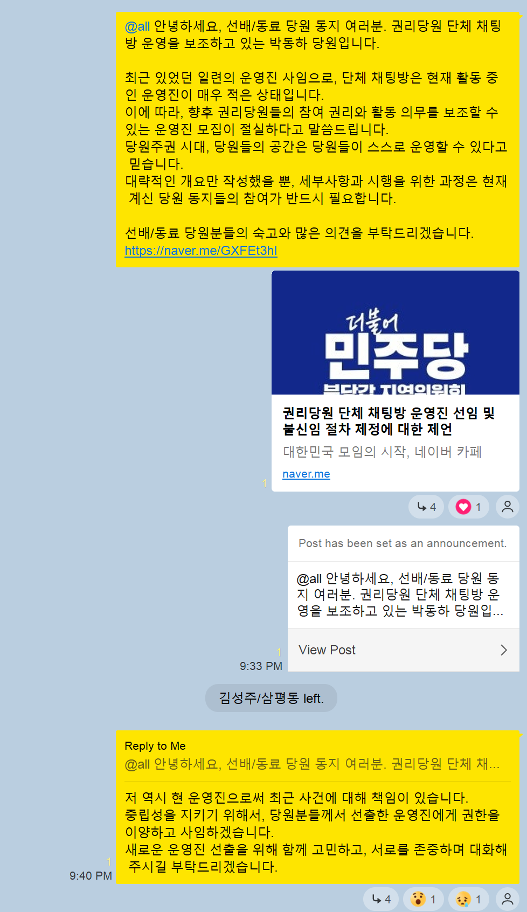

# 2026-04-10 정효진 당원의 부방장 직위해제 및 방장직 사임의사 표명에 대해서

## 배경

배경 설명을 간단히 드리겠습니다.
당시 분당갑 권리당원 일부가 모여있는 단체 카카오톡 오픈채팅방이 있었습니다. 지금은 [분당민주크루](https://bundangminjoocrew.github.io/)로 새롭게 출발했습니다.

- 정효진: 당시 분당갑 사무국장, 부방장
- 박동하(@luncliff): 당시 채팅방 운영진, 방장
- 정OO: 당시 채팅방 운영진, 부방장.
- 이외 인물은 배제했습니다.

2026-04-07 권리당원들이 있는 채팅방에서 채팅을 동결하는 조치가 있었습니다.
동결지시는 정효진 당원에게 받았으며, 조치는 저 박동하가 진행했습니다.
당시 업무 도중 함께 운영진을 맡고있던 당원의 전화를 받았고, 이미 그 시점에 정효진 당원에 의한 메시지 가림 조치가 이미 상당히 누적된 상태였습니다. 

- 
- 
- 

이 날은 단수공천으로 분당갑(제5선거구, 제6선거구) 도의원 후보들이 확정된 날이었습니다.
후보들의 기사가 발단이 되어, 채팅이 많이 발생하고 있었습니다. 

## 채팅방에서 적용중이던 규칙

권리당원들의 공간에는 규칙이 필요하기 때문에, 2026년 2월에 일련의 과정을 거쳐 규칙을 정해서 운영하고 있었습니다.

- 
- 규칙 초안
   - https://naver.me/Fz8XbF0S
   - https://cafe.naver.com/minjoobundang/64
   - PDF: [minjoobundang64 권리당원 단체 카카오톡 채팅방 운영규칙 제안 및 의견 요청](../images/minjoobundang64.pdf)
- 규칙 정리 및 적용 시작
   - https://naver.me/Gpr6wS1J
   - https://cafe.naver.com/minjoobundang/67
   - PDF: [minjoobundang67 권리당원 단체 카카오톡 채팅방 운영규칙 - 2026년 상반기](../images/minjoobundang67.pdf)

이 규칙에서 이번 건과 관련된 부분만 짚어서 말씀드리면, 운영진 역시 규칙의 적용 대상으로 명시하고 있다는 것입니다. 또 그 내용 중 하나로 운영진이 이 채팅방 내에서 집행을 하는 경우, 당원분들께 설명할 의무를 가진다는 것입니다.

## 부방장 직위해제

정효진 당원이 위배한 사항은 2가지입니다.

1. 일시적인 채팅방 동결에 대해서는 본인의 심정을 토로하고 사과했습니다만, 앞서 본인이 실행한 메시지 가림 조치에 대해서 설명하지 않았습니다.
2. 책임을 지겠다고 선언했으나, 동결해제 이후 24시간 이상이 지나도록 채팅방의 존속에 대해서 발언이 전혀 없었습니다.

카카오톡 플랫폼에서, 부방장은 채팅방 참여자를 내보내거나, 메시지를 지우는 등 몇몇 권한을 사용할 수 있습니다.
정효진 당원은 이미 당원들의 메시지에 손을 댄 시점에서, 자의적으로 채팅방의 해산을 결정해 당원들을 강퇴조치할 가능성이 있었습니다.

당시 운영진들이 사용하고 있던 텔레그램에서, 이러한 건에 대해 저는 반복적으로 설명의 필요성을 이야기했으나, 명쾌한 대답은 없었습니다.

- 
- 
- 

## 방장직 사임의사 표명

운영진으로 봉사하던 당원 2분이 사퇴하고 방을 떠나는 순간에도, 정효진 당원은 채팅방에서 별다른 말을 하지 않았습니다.

- 
- 

```text
안녕하세요, 아직 운영진으로 봉사하려고 남아있는 박동하 당원입니다.
제가 말씀을 덜 드리면 다른 분들께서 한마디 더 말씀하실 수 있다 생각합니다.
다시 묵묵히 자리를 지키기에 앞서, 선배/동료 당원 동지분들께 짧게 제 개인 의견을 말씀드리고자 합니다.

먼저 언급하고 싶은 부분은, 당원의 의무와 권리입니다.
의무로는 "강령, 당헌/당규, 윤리규범 준수"와, "당이 추천하는 후보자 지원 의무"를 생각하실 것 같습니다.
권리로는 "선거권 및 피선거권", "선출직 당직자 소환요구"이나, "의안 제출권" 정도겠습니다.
그동안 많은 분들이 "당원 채팅방은 왜 존재하는가?"라는 의문을 주셨습니다. 저는 그 질문과 답은 사실 당원 동지들께서 스스로 찾아나가는 것이라고 생각합니다.

하지만, 저는 당원이기에 당헌을 들어 말씀드리자면, 이곳은 권리와 의무를 모두 이행할 수 있는 가장 기본적인 공간입니다. 지역당원들의 중요한 자산이자, 참여 인프라라고 설명할 수 있을 것입니다.
당헌에서 제가 인용하는 부분은 "당원의 참여 활동 의무"와 "당의 조직 활동에 참여할 수 있는 권리"입니다.
혹 분당갑 지역위원회에서 이 방의 해산을 요구한다면, 당원들이 가진 권리를 침해하는 것이 됩니다. 반대로 이 공간을 적절히 운영하고 서로를 존중하지 못한다면, 당원들의 의무 이행이 부족하다는 뜻이 됩니다.

파면 광장에서 많은 시민발언이 있었습니다만, 제가 늘 되뇌는 말이 하나 있습니다.
"법과 제도와 절차만 믿고 있어서는 결코 안된다는 것, 민주주의는 스스로 그것을 쟁취하려고 싸우는 자들에게만 주어진다는 것"
민주당의 당원이라면 어디서든 당원주권을 위해 행동하고, 기여할 수 있습니다. 바위처럼 굳건하게 버텨나갈 수 있습니다.
혹 채팅방 유지가 어려워진다면, 그저 카카오톡이라는 도구가 부족했을 뿐입니다. 몇 번이고 다른 방법을 찾겠습니다. 포기하지 않고 당원 동지들의 옆에서 연대하겠습니다.

당원 박동하 드림.
```

규칙을 지켜야 하는 운영진임에도 규칙을 지키지 않는 과오를 범한 것은 자명한 독단입니다. 저 또한 당원분들의 상황을 분명히 파악하지 않고서, 발언권을 강력하게 제한하는 집행에 대해서 책임을 지는 것은 당연하고 필수적인 것이었습니다.

- 

따라서 저는 당의 주인인 당원 분들께 운영진을 사임하겠다고 분명하게 말씀드린 것입니다.
이어서 4월 10일 아침에 정효진 당원의 부방장 직위를 해제했습니다. 독단에 대해서 스스로 설명하지 않는다면, 신뢰할 수 없었기 때문입니다.

- 

## 이후 정효진 당원의 행동에 대해서

2026-04-10 직위해제 당일, 정효진 당원은 자신이 부방장에서 해제된 것은 불만이 없다고 메시지를 남겼습니다.

- 

2026-04-13 그런데 며칠 뒤에 갑자기 논조가 달라집니다. 운영방안을 저 혼자 생각했는지를 묻고, 마치 제가 지시를 받는 것처럼 질문하는 모습에 위화감을 느꼈습니다. 정효진 당원은 이미 앞서 운영규칙이 만들어지는 과정을 모두 봤기 때문에, 저에게 이러한 질문을 할 이유가 없었습니다.

- 
- 

2026-04-17 위화감을 떨칠 수 없던 저는, 정효진 당원과 가벼운 식사를 하면서 이야기를 제안했습니다.

- 

지역위원회, 더 엄밀하게 말해서는 운영위원회에서 발제하겠다고 제안한 맥락은 이렇습니다.

- 지역위원회에서는 채팅방 개설에만 관여했을 뿐, 그 방의 관리에 대해서는 일절 개입하지 않았습니다. 제가 활동을 보조한 시점에 공식적인 지역위원회 구성원은 정효진 당원뿐이었고, 그의 직위만으로 당사자가 지역위원회를 대리한다고 판단하는 것은 과대해석이 될 수 있었습니다. 운영위원회에서 사무국장에게 모든 사무를 떠넘기고 방기하고 있는 것으로 해석할 수밖에 없었습니다.
- 정효진 당원은 사무국장의 직위에 있음에도, 운영진에게 지역위원회 또는 지역위원장 명의로 된 사항을 공유해 주거나, 논의한 적이 없습니다. 더해서 당시 운영진들에게 일종의 보고를 요청하지도 않았습니다. 통상적으로 임면, 지휘, 보고 등을 포함하는 업무 구조와 비교하면, 이는 지역위원회 관리체계를 벗어난 상태를 의미한다고 봐야 할 것입니다.

일련의 상황에 대해서 지역위원회에 발제하고, 필요하다면 운영위원회의 구성원들이 운영진에 참여함으로써 공백을 해소할 필요가 있었습니다. 
이런 내용을 설명하자, 정효진 본인은 채팅방의 유지와 해산(폭파) 모두 생각하는 양가적 감정, 현재(4월 17일)는 부정적 영향이 크다는 본인의 생각, 그리고 운영위원회 사람들은 채팅방을 신경 쓰지 않는 상황, 본인은 당적확인만 하고 싶다는 의사를 밝혔습니다. 
저 역시 남은 운영진으로써 피로함을 이해한다고 밝히고, 좋게 헤어졌습니다.

- 

2026-04-20 정효진 당원은 다시 부방장 권한을 요구합니다.
이유는 자신이 사무국장이라는 것뿐이었습니다.
바로 며칠 전에 대화한 내용과 완전히 상반되는 이야기에, 저는 무척 혼란스러웠고, 설명을 요구했습니다. 그러나 방을 다시 만들 것이라는 말 이외에는 어떠한 설명도, 설득도 없었습니다.

## 지역위원회 연락 두절

정효진 당원은 그저 부방장에서 해제되었을 뿐, 어떤 제한사항이 있었던 것도 아닙니다. 사무국장으로서 활동하는 것에 방해요소는 없었습니다.

- 
- 

2026-05-23 하남 전략공천 이후, 침묵을 유지하던 정효진 당원은 일련의 언급이나 설명 없이, 결국 채팅방을 떠났습니다. 

- 

이후로 2026년 지역당원대회가 시작되는 7월 22일까지, 저는 지역위원회로부터 채팅방과 관련해 어떠한 연락도 받지 않았고, 정보를 공유받지도 못했습니다.
상무위원회, 운영위원회에서 논의를 했다고 말하지만, 그 결과가 공식적인 경로라고 이해할 수 있는 채널로 공표되지도 않았습니다. 상식적으로, 이것은 계속적인 관리권 유지를 위한 행동이 아닙니다.

이미 정당성의 부족으로 사임의사를 밝힌 상태임에도, 방장권한을 기한 없이 점유하는 것은, 앞서 제가 당원들께 설명드린 취지에 정면으로 배치됩니다. 따라서 저는 주어진 조건 하에서, 민주적 운영으로 나아가기 위해 운영진 선출을 제안하고, 투표까지 진행했던 것입니다.

## 결론

이전부터 지역위원회 명의로 채팅방 참여자들에게 공지된 내용은 없었습니다. 일시적인 프로그램으로 보이는 소식지 공유만 있었을 뿐입니다.
시간이 지나서 본격적인 제9회 전국동시지방선거 유세기간이 되자, 운영위원회를 구성하던 참여자들은 자발적으로 방을 떠나기도 했습니다.

지역위원회가 최초 설립에 관여했다는 것은 쉽게 인정할 수 있는 사안입니다.
그러나 그 이상의 권리를 주장하고 싶은 것이라면, 그에 맞는 논리와 근거가 있어야 합니다.
당원들을 모아서 출범한 이후로 관리체계가 유지되지 않았다면, 그 '공식성'을 입증하는 것은 지역위원회의 몫입니다.
실질적으로 당원이 확인할 수 있었던 것은 경기도당에서 발행한 지역당원대회 공고뿐이지 않았습니까?
심지어, 새 지역위원회는 운영진 선출과정에 입후보할 수 있었습니다. 투표 계획과 제안이 올라왔을 때 의견을 낼 수 있었습니다. 그러나 아무것도 하지 않았습니다.

채팅방은 그저 여러 참여수단 중 하나일 뿐이고, 당원의 참여 권리는 지켜져야 합니다.
공식 소통방은 이미 1개 뿐입니다.
이미 다른 채팅방은 비공식으로 확정되었고, 이제는 방 제목, 썸네일, 운영규칙도 새로 정립했습니다.
마지막으로 공식 채팅방을 안내하며 채팅방을 떠났으면 그것으로 종료된 것입니다.
